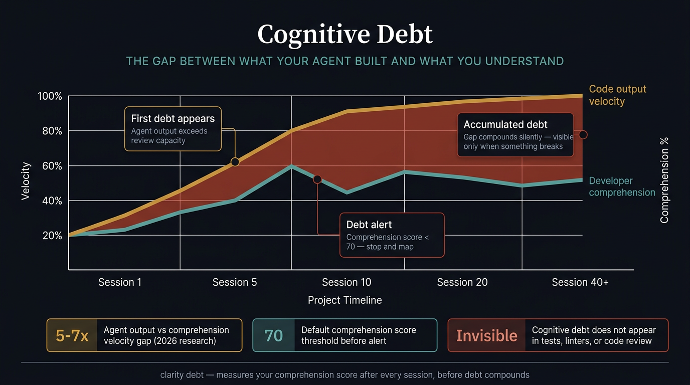
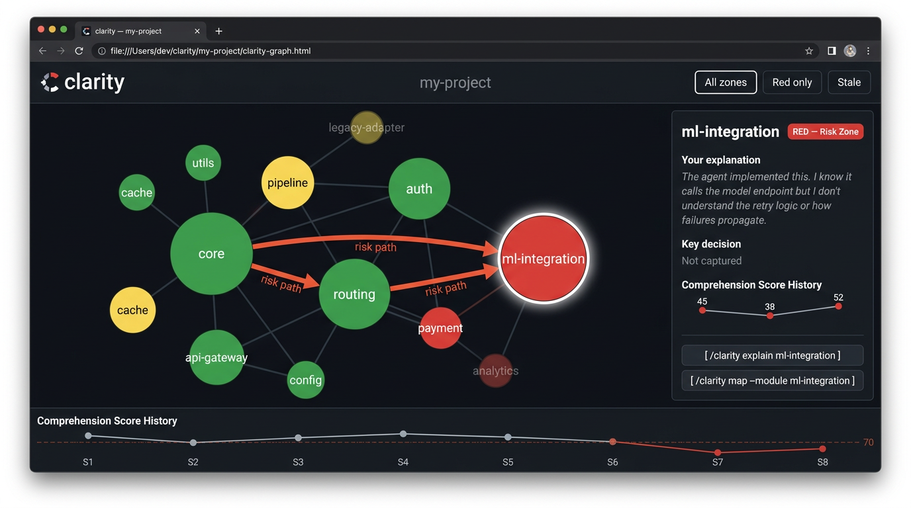
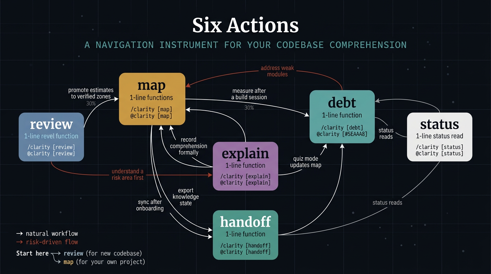
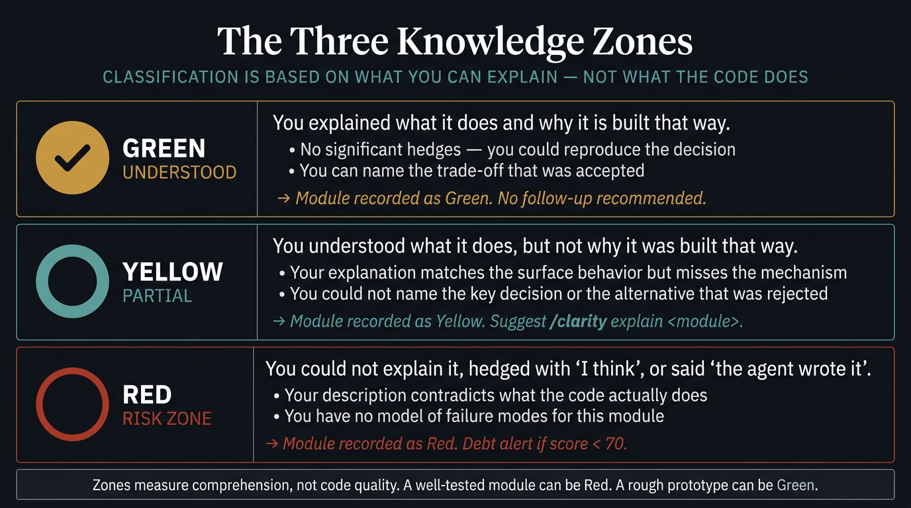

<div align="center">
  
  <br/><br/>
  <p><strong>A knowledge mapping skill for projects built with AI agents.</strong></p>

  <p>
    <a href="https://github.com/FavioVazquez/clarity/releases"></a>
    <a href="LICENSE"></a>
    <a href="https://agentskills.io/specification"></a>
    <a href="https://skills.sh/FavioVazquez/clarity"></a>
  </p>

  <p>
    <a href="#installation">Install</a> &bull;
    <a href="#usage">Usage</a> &bull;
    <a href="#actions">Actions</a> &bull;
    <a href="#the-visual-map">Visual map</a> &bull;
    <a href="#how-it-relates-to-learnship">learnship</a> &bull;
    <a href="CONTRIBUTING.md">Contributing</a> &bull;
    <a href="CHANGELOG.md">Changelog</a>
  </p>
</div>

---

## Installation

### Windsurf (easiest)

```bash
npx skills add FavioVazquez/clarity
```

Installs to the current workspace via the [skills CLI](https://skills.sh).
Also available at [skills.sh/FavioVazquez/clarity](https://skills.sh/FavioVazquez/clarity).

### Claude Code — plugin marketplace

Two steps: add the marketplace, then install the plugin.

```
/plugin marketplace add FavioVazquez/clarity
/plugin install clarity@clarity-marketplace
```

### curl one-liner (any agent)

```bash
# Workspace — current project only (works with all agents)
curl -fsSL https://raw.githubusercontent.com/FavioVazquez/clarity/main/install.sh | bash

# Global — Claude Code
curl -fsSL https://raw.githubusercontent.com/FavioVazquez/clarity/main/install.sh | bash -s -- --global --agent claude

# Global — Windsurf
curl -fsSL https://raw.githubusercontent.com/FavioVazquez/clarity/main/install.sh | bash -s -- --global --agent windsurf

# Uninstall
curl -fsSL https://raw.githubusercontent.com/FavioVazquez/clarity/main/install.sh | bash -s -- --uninstall
```

### git clone

```bash
# Workspace (all agents)
git clone --depth 1 https://github.com/FavioVazquez/clarity .agents/skills/clarity

# Global — Claude Code
git clone --depth 1 https://github.com/FavioVazquez/clarity ~/.claude/skills/clarity

# Global — Windsurf
git clone --depth 1 https://github.com/FavioVazquez/clarity ~/.codeium/windsurf/skills/clarity
```

### Compatibility

Works with any [AgentSkills-compatible](https://agentskills.io/specification)
agent: Claude Code, Windsurf, Cursor, GitHub Copilot, Gemini CLI, Amp, Warp,
Cline, Codex, and more.

---

## Usage

Invocation syntax depends on your agent. The skill name and all actions are
identical; only the prefix differs.

| Agent | Prefix | Example |
|-------|--------|---------|
| **Claude Code** | `/clarity` | `/clarity map` |
| **Windsurf** | `@clarity` | `@clarity map` |
| **Cursor, Copilot, others** | `@clarity` | `@clarity map` |

Quick reference:

| What you want to do | Claude Code | Windsurf / others |
|--------------------|-------------|-------------------|
| Build the knowledge map | `/clarity map` | `@clarity map` |
| Measure cognitive debt from today's session | `/clarity debt` | `@clarity debt` |
| Measure comprehension with no git or diff | `/clarity debt --scan` | `@clarity debt --scan` |
| Autonomous risk scan, no questions asked | `/clarity review` | `@clarity review` |
| Have the agent teach you a specific module | `/clarity explain <module>` | `@clarity explain <module>` |
| Generate a handoff document | `/clarity handoff` | `@clarity handoff` |
| Quick handoff with no time for a map session | `/clarity handoff --cold` | `@clarity handoff --cold` |
| Onboard as a new team member | `/clarity handoff --import` | `@clarity handoff --import` |
| See the project knowledge snapshot | `/clarity status` | `@clarity status` |

---

## The problem

AI coding agents write code faster than developers can understand it.

Research from early 2026 puts the gap at 5-7x: agents produce 140-200 lines per
minute; a developer reads and genuinely understands 20-40 lines per minute. Over a
full session, the delta compounds. Over a full project, it becomes a liability
that does not show up in tests, linters, or code review — it shows up when
something breaks and no one knows why.

This is **cognitive debt**: the gap between what the agent built and what the
developer actually understands. It is different from technical debt. Technical debt
is about code quality. Cognitive debt is about comprehension. You can have
well-structured, test-covered code and still have cognitive debt.

`clarity` makes it visible.

<p align="center">
  
</p>

---

## What clarity does

Six actions, one job: make the human's understanding of the project a first-class,
persistent artifact — and help build that understanding when it is missing.

| Action | What it produces |
|--------|-----------------|
| `map` | Classifies each module as Green / Yellow / Red based on your answers. Writes `CLARITY_MAP.md` and `clarity-graph.html`. |
| `debt` | Measures comprehension from a git diff, a full codebase scan, or your session description. Logs a Comprehension Score. |
| `review` | Autonomous agent scan — reads the codebase and produces risk estimates with no user input. Writes `CLARITY_REVIEW.md`. |
| `explain` | Agent teaches you a specific module interactively. Optional `--quiz` to verify and record comprehension. |
| `handoff` | Generates `CLARITY_HANDOFF.md`. Works with or without a map. `--cold` for autonomous handoff with no user input. |
| `status` | Concise snapshot of user-verified zones, agent estimates, debt score, and last dates. |

---

## The visual map

When you run `map` or `debt`, the agent generates `clarity-graph.html` in your
project root. Open it in any browser — no server, no build step.

The graph shows every module as a node. Green nodes are understood. Yellow nodes
have gaps. Red nodes are risk zones. Edges show dependencies between modules.
An edge that connects a Green node to a Red node turns orange — a propagation
path where a misunderstood module can affect something you thought you knew.

The graph ages. Nodes darken over time if they have not been evaluated recently,
making accumulated cognitive debt visible at a glance.

Click any node to see the detail panel: the user's own explanation, the key
decision captured, the last Comprehension Score, and when the module was last
evaluated.

<p align="center">
  
</p>

---

## Actions

<p align="center">
  
</p>

### `map`

Builds the knowledge map for the project. The agent walks through each module,
asks two questions (what it does, and what the key decision behind it was), and
classifies each one based on your answer — not its own analysis.

Use `--explain` when starting in unfamiliar territory: the agent gives a 2-3 sentence
reading of each module before asking you, so you have something to react to instead
of a blank page.

```
# Claude Code
/clarity map
/clarity map --quick         # only new, Red, or Yellow modules
/clarity map --module auth   # evaluate one module
/clarity map --explain       # agent reads each module first, then asks

# Windsurf / others
@clarity map
@clarity map --quick
@clarity map --module auth
@clarity map --explain
```

The three zones:
- **Green:** You explained what it does and why it is built that way.
- **Yellow:** You knew the what but not the why, or your explanation matched the surface but missed the mechanism.
- **Red:** You could not explain it, said "I think," said "the AI wrote it," or contradicted the actual code.

<p align="center">
  
</p>

### `debt`

Measures cognitive debt from three possible sources — auto-selected based on context:

- **Diff mode** (default): reads `git diff HEAD~1 HEAD` when git is available
- **Scan mode** (`--scan`): reads the codebase directly and picks the most complex areas — no git required
- **Session mode** (`--session`): asks you what was built, then forms questions from your description

For each source, the agent picks three areas of meaningful logic and asks one what,
one why, and one what-if question. Answers are scored 0-100. The session
Comprehension Score is the average. If it falls below the threshold (default: 70),
the agent flags the session as a debt alert.

```
# Claude Code
/clarity debt              # auto-selects mode
/clarity debt --scan       # read codebase directly, no git needed
/clarity debt --session    # describe what you built, then get questions
/clarity debt --history    # show full debt log
/clarity debt --threshold 60

# Windsurf / others
@clarity debt
@clarity debt --scan
@clarity debt --session
@clarity debt --history
@clarity debt --threshold 60
```

### `review`

Autonomous agent codebase scan — no questions asked. The agent reads every module
and classifies them by risk signals: complexity, coupling, opacity, churn, and
AI-generation patterns. All zones are marked `(agent estimate)` to distinguish
them from user-verified comprehension.

Use it when joining an unfamiliar project, before a refactor, or when you want
a structural overview before deciding where to focus `map` or `explain`.

```
# Claude Code
/clarity review            # full scan
/clarity review --module auth  # review one module
/clarity review --deep     # adds plain-language descriptions of Red-estimated modules

# Windsurf / others
@clarity review
@clarity review --module auth
@clarity review --deep
```

Produces `CLARITY_REVIEW.md`. Does not write to `CLARITY_MAP.md` — run
`map --module <name>` to promote any estimate to a user-verified zone.

### `explain`

The Feynman technique in reverse. Instead of asking you to explain, the agent
explains the module to you — layered, plain-language, pausing after each layer
for questions. Use it when a module is Red and you want to address it, or when
a new team member needs to understand a specific area first.

With `--quiz`, the agent checks comprehension at the end and updates `CLARITY_MAP.md`.

```
# Claude Code
/clarity explain auth           # agent explains auth module
/clarity explain auth --quiz    # explain + comprehension check + update map

# Windsurf / others
@clarity explain auth
@clarity explain auth --quiz
```

### `handoff`

Produces `CLARITY_HANDOFF.md` capturing everything the next person needs that
is not in the code. Works with or without an existing map:

- **With a map:** uses user-verified zones and the full debt history
- **Without a map:** reads the codebase directly and produces an agent-estimated handoff, clearly marked
- **`--cold`:** fully autonomous — no user input at all. For when someone is leaving with no time for a map session.

```
# Claude Code
/clarity handoff               # generate handoff (with or without map)
/clarity handoff --cold        # fully autonomous handoff, no user input
/clarity handoff --import      # you are the new person — agent guides you through it
/clarity handoff --sync        # after onboarding, update the map

# Windsurf / others
@clarity handoff
@clarity handoff --cold
@clarity handoff --import
@clarity handoff --sync
```

`--import` no longer requires a handoff file. If no handoff or map exists, the
agent offers to run `review` first and uses that as the onboarding base.

### `status`

A concise snapshot of user-verified zones, agent estimates, debt score, and
last activity dates. Works even when no files exist — recommends a starting action.

```
# Claude Code
/clarity status

# Windsurf / others
@clarity status
```

---

## The visual map in detail

`clarity-graph.html` is a self-contained, interactive D3.js force-directed graph.

**Nodes** represent modules. Size is proportional to line count. Color reflects
knowledge zone: green, yellow, or red. Nodes fade over time when not evaluated.

**Edges** represent dependencies between modules. An edge turns orange when it
connects a well-understood module to a risk zone.

**Interactions:**
- Hover over a node to see its name, zone, and last evaluation date
- Click a node to open the detail panel: your explanation, the key decision,
  Comprehension Scores over time
- Filter to show only Red zones, only stale nodes, or only risk-propagation edges
- A timeline panel at the bottom shows the Comprehension Score history

The agent updates the graph whenever you run `map` or `debt`. It is a single
static file — commit it, share it, or open it offline.

---

## Files written to your project

```
CLARITY_MAP.md      user-verified knowledge map — zones, debt log, open questions
CLARITY_REVIEW.md   agent-estimated risk scan — written by review or handoff --cold
CLARITY_HANDOFF.md  context transfer document — written by handoff
clarity-graph.html  interactive visual map — generated by map and debt
```

`CLARITY_MAP.md` and `CLARITY_REVIEW.md` are kept separate on purpose: one records
what you verified, the other records what the agent estimated. The distinction matters.

All files are yours. Commit them.

---

## How it relates to learnship

[learnship](https://github.com/FavioVazquez/learnship) manages the agent's
memory across sessions: persistent context, structured phases, workflow state.

`clarity` manages yours: what you understand, what you don't, and how to
transfer that when someone new joins the project.

They are independent. A natural rhythm with both: build a phase with `learnship`,
run `debt` at the end, run `map` before any phase where you are entering unfamiliar
territory, run `review` when onboarding someone new or rejoining after a long break.

`clarity` reads `AGENTS.md` if it exists to avoid duplicating what `learnship`
already tracks, but does not require it.

---

## The science

The three-zone classification is based on the Feynman technique: if you can
explain something simply, in your own words, without hedging, you understand it.
If you can't, you have a gap — regardless of whether the code runs.

Cognitive debt research (2026) documents a consistent 5-7x gap between AI agent
output velocity and human comprehension velocity. The gap compounds across sessions
because each new build session adds more code than the developer can process.

See [references/cognitive-debt.md](references/cognitive-debt.md) and
[references/feynman-technique.md](references/feynman-technique.md) for the
primary sources.

---

## Contributing

Contributions are welcome. Read [CONTRIBUTING.md](CONTRIBUTING.md) for how to
improve actions, add reference material, and what correct behavior looks like
for this skill.

---

## License

MIT — see [LICENSE](LICENSE)

---

<div align="center">
  <p>Built by <a href="https://github.com/FavioVazquez">Favio Vazquez</a>.</p>
  <p><em>The code works is not the same statement as I understand this code.</em></p>
</div>
