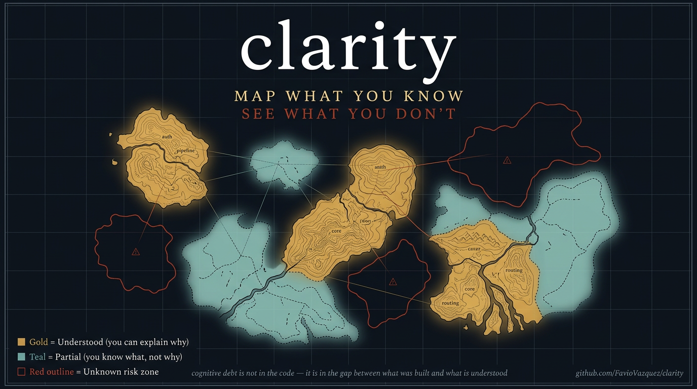

<div align="center">
  
  <br/><br/>
  <p><strong>A knowledge mapping skill for projects built with AI agents.</strong></p>

  <p>
    <a href="https://github.com/FavioVazquez/clarity/releases"></a>
    <a href="LICENSE"></a>
    <a href="https://agentskills.io/specification"></a>
    <a href="https://skills.sh/FavioVazquez/clarity"></a>
  </p>

  <p>
    <a href="#installation">Install</a> &bull;
    <a href="#actions">Actions</a> &bull;
    <a href="#the-visual-map">Visual map</a> &bull;
    <a href="#how-it-relates-to-learnship">learnship</a> &bull;
    <a href="CONTRIBUTING.md">Contributing</a> &bull;
    <a href="CHANGELOG.md">Changelog</a>
  </p>
</div>

---

## The problem

AI coding agents write code faster than developers can understand it.

Research from early 2026 puts the gap at 5-7x: agents produce 140-200 lines per
minute; a developer reads and genuinely understands 20-40 lines per minute. Over a
full session, the delta compounds. Over a full project, it becomes a liability
that does not show up in tests, linters, or code review — it shows up when
something breaks and no one knows why.

This is **cognitive debt**: the gap between what the agent built and what the
developer actually understands. It is different from technical debt. Technical debt
is about code quality. Cognitive debt is about comprehension. You can have
well-structured, test-covered code and still have cognitive debt.

`clarity` makes it visible.

---

## What clarity does

Four actions, one job: track the human's understanding of the project as a
persistent, versioned artifact.

| Action | What it produces |
|--------|-----------------|
| `@clarity map` | Classifies each module as Green / Yellow / Red based on your answers, writes `CLARITY_MAP.md`, generates `clarity-graph.html` |
| `@clarity debt` | Asks 3 questions derived from your last diff, scores your answers, logs a Comprehension Score to `CLARITY_MAP.md` |
| `@clarity handoff` | Generates `CLARITY_HANDOFF.md` for a new team member, or guides you through an existing one with `--import` |
| `@clarity status` | Shows a concise snapshot of zones, debt score, and last handoff date |

---

## The visual map

When you run `@clarity map`, the agent generates `clarity-graph.html` in your
project root. Open it in any browser — no server, no build step.

The graph shows every module as a node. Green nodes are understood. Yellow nodes
have gaps. Red nodes are risk zones. Edges show dependencies between modules.
An edge that connects a Green node to a Red node turns orange — that is a
propagation path, where a misunderstood module can affect something you thought
you knew.

The graph ages. Nodes darken over time if they have not been evaluated recently,
making accumulated cognitive debt visible at a glance.

Click any node to see the detail panel: the user's own explanation, the key
decision captured, the last Comprehension Score, and when the module was last
evaluated.

---

## Actions

### `@clarity map`

Builds the knowledge map for the project. The agent walks through each module and
asks two questions: what it does, and what the key decision behind it was. It
classifies each one based on your answer, not its own analysis.

```
@clarity map               # full map — all modules
@clarity map --quick       # only modules that are new, Red, or Yellow
@clarity map --module auth # evaluate one module
```

The three zones:
- **Green:** You explained what it does and why it is built that way.
- **Yellow:** You knew the what but not the why, or hedged on the key decision.
- **Red:** You could not explain it, said "I think," or said "the AI wrote it."

### `@clarity debt`

Measures cognitive debt from the most recent build session. The agent reads your
last git diff, picks three areas of meaningful logic, and asks:

- **What** a specific function does
- **Why** a specific approach was used instead of the obvious alternative
- **What happens if** a specific edge case occurs

Each answer is scored 0-100. The session Comprehension Score is the average.
If the score falls below the threshold (default: 70), the agent flags the session
as a debt alert before you continue building.

```
@clarity debt              # evaluate the current session
@clarity debt --history    # show the full debt log
@clarity debt --threshold 60  # change the alert threshold
```

### `@clarity handoff`

Produces a `CLARITY_HANDOFF.md` that captures everything the next person needs
to know that is not in the code: which areas are understood, which are not,
what the open questions are, and what to do first.

```
@clarity handoff           # generate the handoff document
@clarity handoff --import  # you are the new person — agent guides you through it
@clarity handoff --sync    # after onboarding, update the map with new understanding
```

### `@clarity status`

A five-line snapshot of the current knowledge state.

```
@clarity status
```

---

## The visual map in detail

`clarity-graph.html` is a self-contained, interactive D3.js force-directed graph.

**Nodes** represent modules. Size is proportional to line count. Color reflects
knowledge zone: green, yellow, or red. Nodes fade over time when not evaluated.

**Edges** represent dependencies between modules — which modules import or call
others. An edge turns orange when it connects a well-understood module to a
risk zone.

**Interactions:**
- Hover over a node to see its name, zone, and last evaluation date
- Click a node to open the detail panel: your explanation, the key decision,
  Comprehension Scores over time
- Filter to show only Red zones, only stale nodes, or only risk-propagation edges
- A timeline panel at the bottom shows the Comprehension Score history

The graph is generated by the agent and lives as a single file in your project
root. The agent updates it whenever you run `@clarity map` or `@clarity debt`.
You can commit it, share it, or open it offline.

---

## Files written to your project

```
CLARITY_MAP.md       knowledge map — zones, debt log, open questions
CLARITY_HANDOFF.md   handoff snapshot (generated on request)
clarity-graph.html   interactive visual map
```

These files are yours. Commit them. The graph file makes the knowledge state
of the project as visible as a CI dashboard.

---

## Installation

### Option 1 — `npx skills` (easiest)

```bash
npx skills add FavioVazquez/clarity
```

Installs to the current workspace. Also available at
[skills.sh/FavioVazquez/clarity](https://skills.sh/FavioVazquez/clarity).

### Option 2 — Claude Code plugin marketplace

First add the marketplace, then install the plugin:

```
/plugin marketplace add FavioVazquez/clarity
/plugin install clarity@clarity-marketplace
```

### Option 3 — `curl` one-liner

```bash
# Workspace (current project only)
curl -fsSL https://raw.githubusercontent.com/FavioVazquez/clarity/main/install.sh | bash

# Global — Claude Code
curl -fsSL https://raw.githubusercontent.com/FavioVazquez/clarity/main/install.sh | bash -s -- --global --agent claude

# Global — Windsurf
curl -fsSL https://raw.githubusercontent.com/FavioVazquez/clarity/main/install.sh | bash -s -- --global --agent windsurf

# Uninstall
curl -fsSL https://raw.githubusercontent.com/FavioVazquez/clarity/main/install.sh | bash -s -- --uninstall
```

### Option 4 — `git clone`

```bash
# Workspace (all agents)
git clone --depth 1 https://github.com/FavioVazquez/clarity .agents/skills/clarity

# Global — Claude Code
git clone --depth 1 https://github.com/FavioVazquez/clarity ~/.claude/skills/clarity

# Global — Windsurf
git clone --depth 1 https://github.com/FavioVazquez/clarity ~/.codeium/windsurf/skills/clarity
```

### Compatibility

Works with any [AgentSkills-compatible](https://agentskills.io/specification)
agent, including Claude Code, Windsurf, Cursor, GitHub Copilot, Gemini CLI,
Amp, Warp, Cline, and Codex.

---

## How it relates to learnship

[learnship](https://github.com/FavioVazquez/learnship) manages the agent's
memory across sessions: persistent context, structured phases, workflow state.

`clarity` manages yours: what you understand, what you don't, and how to
transfer that when someone new joins the project.

They are independent. If you use both, a natural rhythm is: build a phase with
`learnship`, then run `@clarity debt` at the end of the phase. Run
`@clarity map` before any phase where you are entering territory you have not
touched in a while.

`clarity` reads `AGENTS.md` if it exists to avoid duplicating what `learnship`
already tracks, but does not require it.

---

## The science

The three-zone classification is based on the Feynman technique: if you can
explain something simply, in your own words, without hedging, you understand it.
If you can't, you have a gap — regardless of whether the code runs.

Cognitive debt research (2026) documents a consistent 5-7x gap between AI agent
output velocity and human comprehension velocity. The gap compounds across sessions
because each new build session adds more code than the developer can process.

See [references/cognitive-debt.md](references/cognitive-debt.md) and
[references/feynman-technique.md](references/feynman-technique.md) for the
primary sources.

---

## Contributing

Contributions are welcome. Read [CONTRIBUTING.md](CONTRIBUTING.md) for how to
improve actions, add reference material, and what correct behavior looks like
for this skill.

---

## License

MIT — see [LICENSE](LICENSE)

---

<div align="center">
  <p>Built by <a href="https://github.com/FavioVazquez">Favio Vazquez</a>.</p>
  <p><em>The code works is not the same statement as I understand this code.</em></p>
</div>
